```{r setup, include = FALSE}
knitr::opts_chunk$set(
  collapse = TRUE,
  comment = "#>"
)
```

```{r, include = FALSE}
### needed libraries
library(mapdata)
library(plotdap)
library(rerddap)

```


# plotdap
The R package **plotdap** makes it easy to visualize 'tabledap' and 'griddap' objects obtained via the [**rerddap**](https://CRAN.R-project.org/package=rerddap) package. Maps can be made using either base or ggplot2 graphics, and the user does not need to know the intricacies of obtaining continental outlines, projections, and combining those with the data to form maps. Animations of the data are also readily obtained. `plotdap` works in a similar fashion with either tables or grids return by `rerddap` further simplifying the mapping process.

A user who desires fine control of their maps should learn how to map the data themselves  - some examples are give in the `rerddap` vignette.  But `plotdap` provides a simplified workflow of obtaining data using `rerddap` and quickly and simply mapping the data.  In what follows we go over how to install  `plotdap` and it's basic usage,  as well as how to utilize some of the more important options in the package in order to improve the map.


## Installation

**plotdap** can be installed from CRAN with:


```{r, eval = FALSE}
install.packages("plotdap")
```


and the development version can be installed with:


```{r, eval = FALSE}
devtools::install_github('ropensci/plotdap')
```


## Getting started with `plotdap()`

The `plotdap()` function makes it easy to visualize data acquired via `rerddap::tabledap()` or `rerddap::griddap()`. Regardless of the data you want to visualize, you'll always want to start a plot via `plotdap()`, where you may specify some "global" plotting options. Subsequent sections will demonstrate how to add tables/grids via `add_tabledap()`/`add_griddap()`, but for now we'll focus on options provided by `plotdap()`. Most importantly, the first argument decides whether base 'R' graphics or [ggplot2](https://cran.r-project.org/package=ggplot2) graphics should be used for the actual plotting.


```{r world, fig.align = 'center', fig.height = 4, fig.width = 5}
library(plotdap)
plotdap()
plotdap("base")
```


In addition to choosing a plotting method, `plotdap()` is where you can define
properties of the background map, including the target projection using a valid
coordinate reference system (CRS) definition. Projection is performed using the
[PROJ.4 library](https://proj.org/), and
[spatialreference.org](https://www.spatialreference.org) is a great resource for
finding PROJ.4 CRS descriptions. Using the search utility, you can for example,
[search for "South
Pole"](https://spatialreference.org/ref/sr-org/?search=South+Pole&srtext=Search)
and pick from a number of options. Here I've chosen the [MODIS South Pole
Stereographic](https://spatialreference.org/ref/sr-org/8375/) option and
copy-pasted the [Proj4 page](https://spatialreference.org/ref/sr-org/8375/proj4/)
with the CRS definition:


```{r southPole, fig.align = 'center', fig.height = 4, fig.width = 5}
plotdap("base",
  mapTitle = "MODIS South Pole Stereographic", 
  mapFill = "transparent", 
  mapColor = "steelblue",
  crs = "+proj=stere +lat_0=-90 +lat_ts=-90 +lon_0=-63 +k=1 +x_0=0 +y_0=0 +ellps=WGS84 +datum=WGS84 +units=m +no_defs"
)
```


You might notice that some projections aren't "well-defined" on a global scale,
and thus, may result in an error, or a "broken" looking map. For instance, [this
Albers projection centered on
Alaska](https://spatialreference.org/ref/epsg/3467/):


```{r alaska, fig.align = 'center', fig.height = 4, fig.width = 5}
alaska <- "+proj=aea +lat_1=55 +lat_2=65 +lat_0=50 +lon_0=-154 +x_0=0 +y_0=0 +ellps=GRS80 +towgs84=0,0,0,0,0,0,0 +units=m +no_defs"
plotdap("base", crs = alaska)
```


That does not mean we can't use this (or similar) projections -- we just have to
be careful that they are sensible given the lat/lon limits. By default, those
limits span the entire world, but as we'll see later, the limits are shrunk to
the given data (i.e., `griddap()` / `tabledap()`) limits. In other words, we
should expect this projection to work once we "add" some data located near
Alaska to the visualization. However, in case you want to make a map without any
data, or want to customize the background map in some special way, you can
supply an [**sf**](https://CRAN.R-project.org/package=sf) object (or something
coercable to an **sf** object) to the `mapData` argument.


```{r, echo = FALSE}
alaska <- "+proj=aea +lat_1=55 +lat_2=65 +lat_0=50 +lon_0=-154 +x_0=0 +y_0=0 +ellps=GRS80 +towgs84=0,0,0,0,0,0,0 +units=m +no_defs"
```


```{r usmap, fig.align = 'center', fig.height = 4, fig.width = 5}
library(sf)
library(mapdata)
w <- st_as_sf(maps::map("world", plot = FALSE, fill = TRUE))
us <- st_transform(subset(w, ID == "USA"), alaska)
plotdap(mapData = us)
```


With the odd exception of window sizing and projections, the options in
`plotdap()` should *just work* in a similar way for either plotting method.
However, there are some useful options that are deliberately left out, since
they work differently based on the plotting method.

The `mapData` argument can be used to change the resolution of the continental
outlines or to limit the outline to a pre-selected area, which can speed up
processing because fewer unused polygons need to be clipped.  This is
particularly important for maps that will cross the dateline. So for example to use
the hi-res outlines for VIIIRS SST off the coast of North America:

```{r get_viirsSST, eval = FALSE }
sstInfo <- rerddap::info('erdVHsstaWS3day')
# get latest 3-day composite sst
viirsSST <- rerddap::griddap(sstInfo, 
                             latitude = c(41., 31.), 
                             longitude = c(-128., -115), 
                             time = c('last','last'), 
                             fields = 'sst')

```

```{r viirs_hires,echo = TRUE, eval = FALSE}
w <- map("worldHires", xlim = c(-140., -114), ylim = c(30., 42.), 
         fill = TRUE, plot = FALSE)
# map using that outline,  temperature color from cmocean
add_griddap(plotdap(mapData = w), viirsSST, ~sst, fill = "thermal" )

```


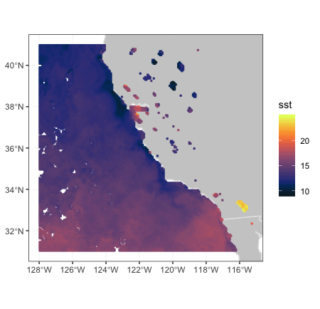


Maps that cross the dateline work better using the "world2" or "world2Hires"
databases frpm the `mapdata` package.  There is a known problem with that
continental database in that polygons from certain countries cause artificial
lines in the map,  and must removed,  as done below.

```{r world2Hires, fig.align = 'center', fig.height = 3, fig.width = 5,  message = FALSE, warning = FALSE}
xpos <- c(135.25, 240.25)
ypos <- c(20.25, 60.25)
zpos <- c(70.02, 70.02)
remove <- c("UK:Great Britain", "France", "Spain", "Algeria", "Mali", "
            Burkina Faso", "Ghana", "Togo")
#subset world2Hires with those countries removed
w <- map("world2Hires", plot = FALSE, fill = TRUE, ylim = ypos, xlim = xpos)
w <- map("world2Hires", regions = w$names[!(w$names %in% remove)], 
         plot = FALSE, fill = TRUE, ylim = ypos, xlim = xpos)
# plot result
plotdap(mapData = w)

``` 


Since the result of `plotdap()` is always a map, it always forces a fixed aspect
ratio (i.e., $\frac{height}{width}$ of graph equals
$r=\frac{latitude}{longitude}$). For this reason, the current size of your
graphics device may not be sensible for the value of $r$ (for instance, if $r$
is high, but the height of the graphics device is small, you may see an error
such as: `polygon edge not found` since the device cannot possibly render the
result under the conditions). For a number of reasons, `plotdap()` will not
automatically resize your graphics device; instead, it's recommended that you
use a reliable graphics device such as Cairo, and use a height/width ratio close
to $r$.


```{r cairo, eval = FALSE,  echo = TRUE, warning = FALSE, message = FALSE}
# write plot to disk using the Cairo package
library(Cairo)
# (latitude limits) / (longitude limits)
r <- 85 / 120
CairoPNG("myPlot.png", height = 400 * r, width = 400, res = 96)
# alter default margins for base plotting 
# (leaving just enough space for a title)
par(mar = c(0, 0, 1, 0))
plotdap("base", mapData = us, mapTitle = "Albers projection of Alaska")
dev.off()
```


More advanced users that know some base/ggplot2 plotting may want more control of certain aspects of the plot (a later section -- Customizing `plotdap()` objects -- covers this topic). 


## Adding `tabledap()` layers

The `add_tabledap()` function allows you to add markers that encode variable(s) obtained via `tabledap()` to an existing `plotdap()` object. For example, suppose we have the following `sardines` data, and wish to understand the frequency of subsample counts:

```{r get_sardines, echo = TRUE, eval = FALSE}
my_url <- 'https://coastwatch.pfeg.noaa.gov/erddap/'
sardines <- tabledap(
  'FRDCPSTrawlLHHaulCatch',
  fields = c('latitude',  'longitude', 'time', 'scientific_name', 
             'subsample_count'),
  'time>=2010-01-01', 'time<=2012-01-01', 'scientific_name="Sardinops sagax"',
   url = my_url)
```

At the very least, `add_tabledap()` needs a base map (i.e., a `plotdap()` object), the `tabledap()` data, and a *formula* defining the variable of interest (for encoding the color of the markers). In R, you can create a formula by prefixing `~` to some expression. This formula can simply reference a variable already residing in the dataset (e.g., `~subsample_count`) or it can be a function of some variables (e.g. `~log2(subsample_count)`):


```{r , echo = TRUE, eval = FALSE}
p1 <- add_tabledap(
  plotdap(crs = "+proj=robin",  mapTitle = "subsample count"), 
  sardines, 
  ~subsample_count
)
p2 <- add_tabledap(
  plotdap(crs = "+proj=robin", mapTitle = "Log subsample count"), 
  sardines, 
  ~log2(subsample_count)
) 

p1
p2

```


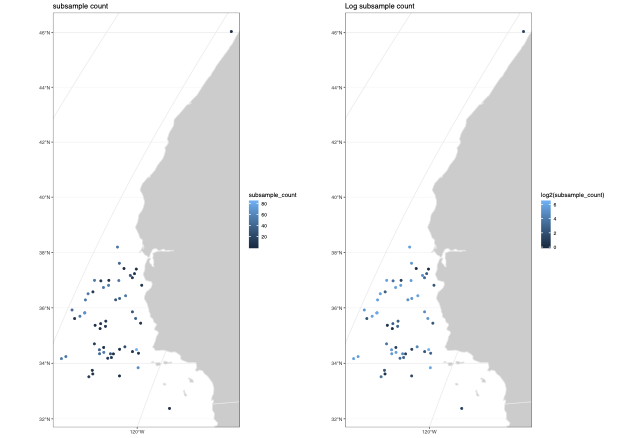


## Modifying `tabledap()` layers

It is also easy to alter the color scale as well as the symbol type and size  in `add_tabledap()` via the `color`, `shape`  and `size` arguments. 


```{r, echo = TRUE, eval = FALSE}
p1 <- add_tabledap(
  plotdap(crs = "+proj=robin", mapTitle = "Sardines - change color"), 
  sardines, 
  ~subsample_count, 
  color = "dense", 
)
p2  <- add_tabledap(
  plotdap(crs = "+proj=robin", mapTitle = "Sardines - change shape and size"), 
  sardines, 
  ~subsample_count, 
  shape = 4,
  size = 1.
)
p1
p2
```


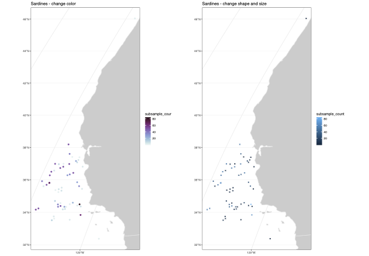

For further details about these arguments, please refer to the documentation on `help(add_tabledap)`.


## Adding `griddap()` layers

Similar to `add_tabledap()`, the `add_griddap()` function makes it easy to add rasters (i.e., rectangular tiles) to a `plotdap()` object. To demonstrate, lets obtain some of the latest sea surface temperatures along the western coast of the US.

```{r get_mur, eval = FALSE}
murSST_west <- griddap(
  'jplMURSST41', 
  latitude = c(22, 51), 
  longitude = c(-140, -105),
  time = c('last', 'last'), 
  fields = 'analysed_sst'
  )
```


Again, similar to `add_tabledap()`, `add_griddap()` needs a base map (i.e., a `plotdap()` object), the `griddap()` data, and a *formula* defining the variable of interest (for encoding the fill of the rectangles). The `add_griddap()` function also has a `maxpixels` argument which sets a maximum threshold for the number of cells (i.e., pixels) to use before projection and plotting occurs. Compared to ggplot2, base plotting is much more efficient at rendering raster objects, so it might be worth increasing the threshold in that case:

```{r plot_mur, echo = TRUE, eval = FALSE}
add_griddap(
  plotdap(crs = "+proj=robin"), 
  murSST_west, 
  ~analysed_sst, 
  maxpixels = 50000
)
```


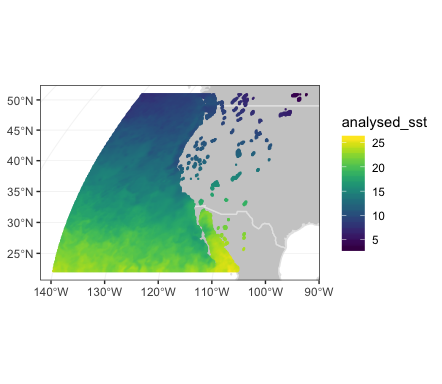


The `murSST_west` grid has a single time point (i.e., `length(unique(murSST_west$data$time)) == 1`), but what do we do when there are multiple time points? In addition to animating multiple grids (a la `add_tabledap()`), you also have the option to summarize multiple grids into a single grid. To demonstrate, lets grab some wind speeds measured along the west coast of the US.

```{r get_wind, eval = FALSE}
wind <- griddap(
  'erdQMwindmday', 
  time = c('2016-04-16', '2016-06-16'),
  latitude = c(30, 50), 
  longitude = c(210, 240),
  fields = 'y_wind'
)
```

When faced with multiple time periods, and `animate = FALSE` (the default), the `time` argument is used to reduce multiple grids (i.e., raster bricks) to a single grid (i.e., a single raster layer). You can pass any R function to the `time` argument, but when `animate = FALSE`, you should take care to ensure the function returns a single value. The default uses the `mean(na.rm = TRUE)` function so that each cell represents the average (in this case amongst three time points), but we could easily set this to `var()` to get the variance for each cell:


```{r, echo = TRUE, eval = FALSE}
p1 <- add_griddap(
  plotdap(mapTitle = "Mean Meridional Wind"), 
  wind, 
  ~y_wind, 
  fill = "delta", 
  time = mean
) 
my_func <- function(x) var(x, na.rm = TRUE)
p2 <- add_griddap(
  plotdap(mapTitle = "Variance of Meridional Wind"), 
  wind, 
  ~y_wind, 
  fill = "delta", 
  time = my_func
) 
p1
p2

```
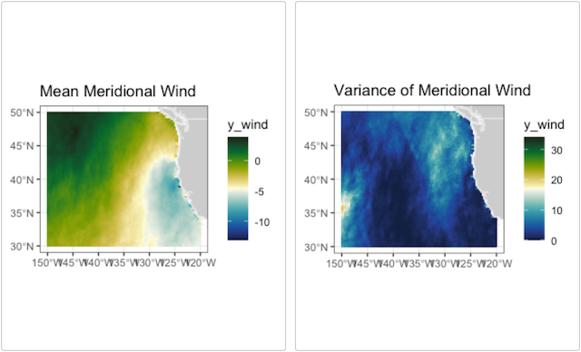

### Changing the layer order


By default,  `add_griddap` plots the land first and then the grid on top of that.
For many uses that is desirable,  but at other times it is more desirable to have the
land mask the grid.  This can now be done in the print method,  by saving the `plotdap` object and printing with the option "landmask = TRUE".


```{r viirsSST_gridland, echo = TRUE, eval = FALSE}
plotdap(mapTitle = "Grid over Land") %>%
      add_griddap(
        viirsSST, 
        ~sst, 
        fill = "thermal"
        )

```

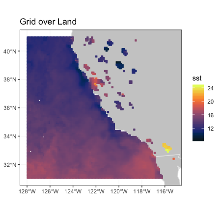

and compare when land is plotted over the grid:

```{r viirsSST_landgrid, echo = TRUE, eval = FALSE}
plotdap(mapTitle = "Land Over Grid") %>%
    add_griddap(
      viirsSST, 
      ~sst, 
      fill = "thermal"
      ) %>%
    print(landmask = TRUE)
```

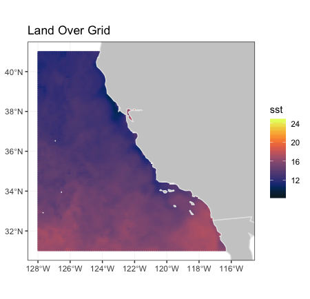


### maxpixels

Images of satellite data can contain a large number of pixels.  `add_griddap()` allows for a differing number of pixels to be used  (default is 10,000) by setting the parameter "maxpixels". When the actual number pixels is larger than the value of "maxpixels",  the image is sub-sampled. This can greatly affect the how the image looks.

```{r maxpix_10, echo = TRUE, eval = FALSE}
plotdap(mapTitle = "maxpixels = 10,000") %>%
    add_griddap(
      viirsSST, 
      ~sst, 
      fill = "thermal",
      maxpixels = 10000 
      )
```


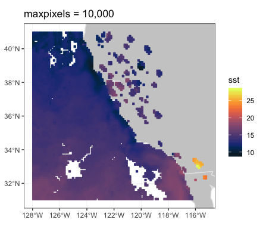


```{r maxpix_50, echo = TRUE, eval = FALSE}
plotdap(mapTitle = "maxpixels = 50,000") %>%
     add_griddap(
       viirsSST, 
       ~sst, 
       fill = "thermal", 
       maxpixels = 50000
       )
```


```{r maxpix_100, echo = TRUE, eval = FALSE}
plotdap(mapTitle = "maxpixels = 100,000") %>%
    add_griddap(
      viirsSST, 
      ~sst, 
      fill = "thermal",  
      maxpixels = 100000
      )
```


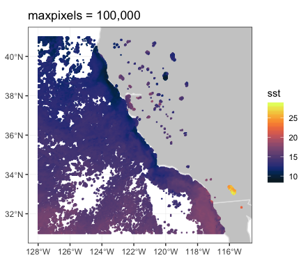

The increased resolution can really make a difference when the land masks the grid:

```{r maxpix_100_mask, echo = TRUE, eval = FALSE}
plotdap(mapTitle = "maxpixels = 100,000, landmask") %>%
    add_griddap(
      viirsSST, 
      ~sst, 
      fill = "thermal",  
      maxpixels = 100000
      ) %>%
    print(landmask = TRUE)
```

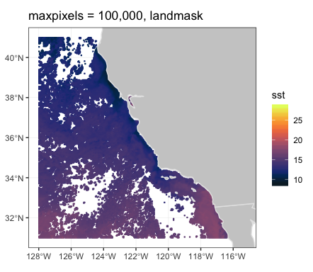

### Working with other continental outlines


My default, `plotdap()` uses the global "world" database from the `map` package,  and then trims the polygons based on the limit of the map.  Higher resolution coastlines or coastlines that cross the dateline require can be used in `plotdap()`by passing this information in the function call. Similarly, computations can be sped up by pre-selecting the area of the coastline database before calling `plotdap()`.

To map the VIIRS SST data from the previous section using a subsetted, high-resolution continental outline, first the subset is defined for the high-resolution database:


```{r hires}
w <- map("worldHires", xlim = c(-130., -114), ylim = c(30., 42.), 
         fill = TRUE, plot = FALSE)
```

and then plotted, with the landmask option:

```{r viirs_hires_mask, echo = TRUE, eval = FALSE}
plotdap(mapData = w) %>%
    add_griddap(
      viirsSST, 
      ~sst, 
      fill = 'thermal',  
      maxpixels = 50000
      ) %>%
    print(landmask = TRUE)
```


The “Simple Ocean Data Assimilation (SODA)” model (see https://www2.atmos.umd.edu/~ocean/) reconstructs the historical physical history of the ocean since the beginning of the 20th century. Here is the temperature at 70m depth for December 2015 for the North Pacific Ocean, as an example of using `plotdap()` when the data cross the dateline:

First, get the SODA data:

```{r soda70_get, echo = TRUE, eval = FALSE}
soda70Info <- rerddap::info('erdSoda331oceanmday')
xpos <- c(135.25, 240.25)
ypos <- c(20.25, 60.25)
zpos <- c(70.02, 70.02)
tpos <- c('2010-12-15', '2010-12-15')
soda70 <- rerddap::griddap(soda70Info,  
                  longitude = xpos, 
                  latitude = ypos, 
                  time = tpos, 
                  depth = zpos, 
                  fields = 'temp' )

``` 

then plot with `plotdap`

```{r soda70, echo= TRUE, eval = FALSE}
remove <- c("UK:Great Britain", "France", "Spain", "Algeria", "Mali", 
            "Burkina Faso", "Ghana", "Togo")
#subset world2Hires with those countries removed
w <- map("mapdata::world2Hires", plot = FALSE, fill = TRUE, 
         ylim = ypos, xlim = xpos)
w <- map("mapdata::world2Hires", regions = w$names[!(w$names %in% remove)], 
         plot = FALSE, fill = TRUE, ylim = ypos, xlim = xpos)
# plot result
plotdap(mapData = w) %>%
        add_griddap(
          soda70, 
          ~temp, 
          fill = "thermal"
          ) %>%
        print(landmask = TRUE) 

```
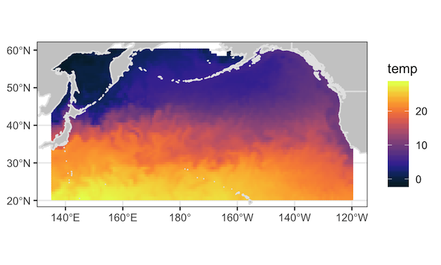

## Combining tables/grids

The `plotdap()` interface is designed so that you can plot both tables and grids at once (although I don't recommend trying to plot more than one `griddap()` or `tabledap()` object at once). It's also designed to work well with the `%>%` operator from the **magrittr** package so that code can be expressed in a left-to-right (rather than inside-out) fashion:

```{r overlay, echo = TRUE, eval = FALSE}
p <-   add_griddap(plotdap(), 
    murSST_west, 
    ~analysed_sst,
    fill = "thermal"
    ) 
p1 <-   add_tabledap(p,
    sardines, 
    ~subsample_count
    )
print(p1, landmask = TRUE)
```

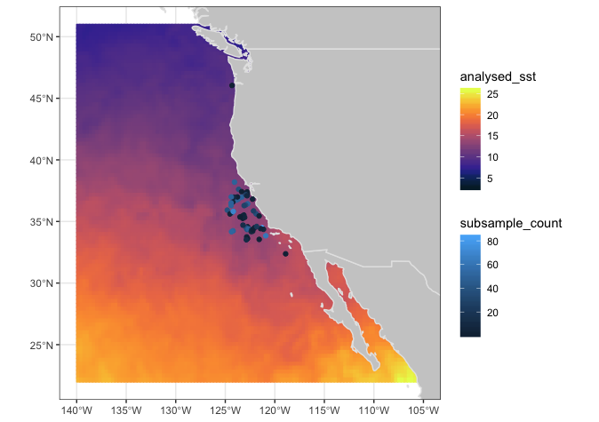

## Modifying `ggplotdap` objects


By this point, you might have noticed some subtle differences in the defaults of `plotdap("ggplot2")` versus `plotdap("base")`. The default base version is intentionally left  minimal as it is often much harder (or impossible) to modify/remove elements from a base graphic once it's drawn. However, this is fairly easy using the **ggplot2** approach (assuming you know a bit of **ggplot2**), thanks to the `add_ggplot()` function (think of it like the `+` operator in **ggplot2**). 


```{r modify, fig.align = 'center', fig.height = 4, fig.width = 5}
library(ggplot2)
plotdap(crs = "+proj=robin") %>%
  add_tabledap(
    sardines, 
    ~subsample_count, 
    size = 1
    ) %>%
  add_ggplot(
    labs(
      subtitle = "Sardinops sagax samples",
      caption = "Sardines are yummy"
    ), 
    theme_minimal(),
    theme(axis.ticks = element_blank(), axis.text = element_blank())
  )
```


Similarly, VIIRS SST plot in the previous section,  detail is lost due to
high values observed in landlocked water.  To modify that plot:


```{r modify2, echo = TRUE, eval = FALSE, timeit = TRUE}
temp_color <- rerddap::colors$temperature
plotdap(mapTitle = "Reset colorscale limits") %>%
    add_griddap(
      viirsSST, 
      ~sst, 
      fill = "thermal"
      ) %>%
    add_ggplot(
       scale_fill_gradientn(colours = temp_color, na.value = NA, limits = c(10, 20)),
        scale_colour_gradientn(colors = temp_color, na.value = NA, limits = c(10, 20)),
        guides(colour = FALSE)
     ) %>%
     print(landmask = TRUE)
```

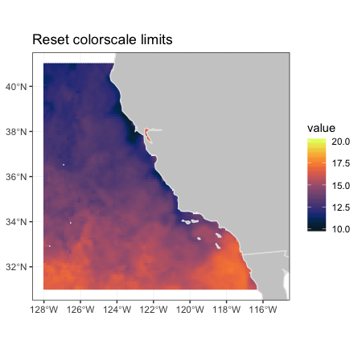


## Animating `plotdap` objects

Since `time` is an important variable in many `tabledap()` and `griddap()` objects, both functions have an `animate` argument which will animate the maps over the `time` variable.  The animations only work for the  `ggplot2` option,  and are based on the latest version of `gganimate`.

`gganimate` is a very powerful package, and many of the options available are designed to allow for "tweening", that is for smooth animation between frames.  Unfortunately for complex maps with many features,  that can lead to very large animations that can take hours to render.  For this reason,  all `plotdap` animations use `gganimate::transition_manual` so that there is one frame for each time period,  and no "tweening" between frames.  The animation can be controlled by saving the animation to an object, and then displaying the saved object using `gganimate::animate()` to control the display.  The 

Since `time` is an important variable in many `tabledap()` objects, `add_tabledap()` also has a `animate` argument which allows you to easily animate over the `time` variable. It is also easy to alter the color scale and symbol type via the `color` and `shape` arguments. For details about these arguments, please refer to the documentation on `help(add_tabledap)`


```{r, eval = FALSE, echo = TRUE}
add_tabledap(
  plotdap(crs = "+proj=robin"), 
  sardines, 
  ~subsample_count, 
  color = "dense", 
  shape = 4, 
  animate = TRUE
)
```

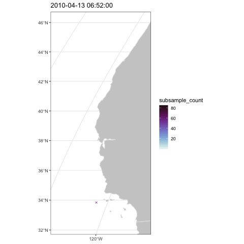

If you just want to animate the raw grid values over time (instead of computing summary statistic(s) for each cell), you can set `time` to the `identity` function, then set `animate = TRUE`:


```{r, eval = FALSE, echo = TRUE }
add_griddap(
  plotdap(crs = "+proj=robin"), 
  wind, ~y_wind, 
  time = identity, 
  fill = 'delta',
  animate = TRUE
)
```


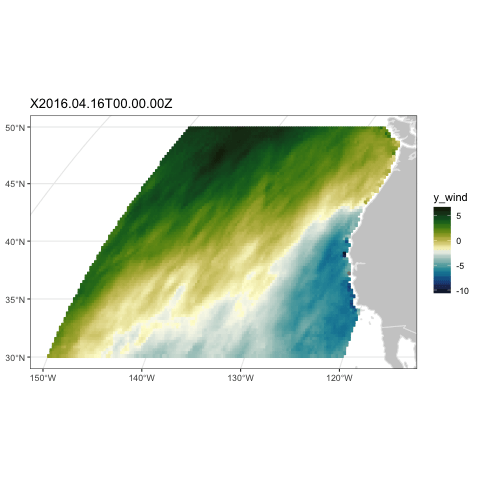
The frames per second and the total number of frames for an animated `plotdap` object `p` can be controlled calling `gganimate::animate(p$ggplot, ...)`  with the desired other settings. Unfortunately,  the map bounding box set in `p` may not be what is desired, because when `plotdap` prints an object it calculates a good bounding box for a map,  but that is not stored in the object `p`. A utility function `bbox_set()` is included which will add a desired bounding box.

```{r, eval = FALSE, echo = TRUE }
p <- add_griddap(
  plotdap(crs = "+proj=robin"), 
  wind, ~y_wind, 
  time = identity, 
  fill = 'delta',
  animate = TRUE
)
  ylim <- c(30, 50)
  xlim <- c(-150, -120)
  p <- bbox_set(p, xlim, ylim)
```


